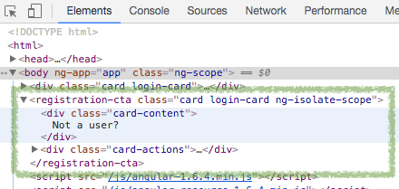
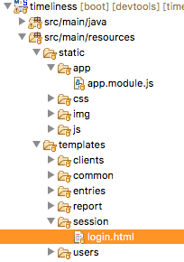

# ./learning-angular-with-timely
 
## api-controllers.png
 

 
## client-edit-form.png
 

 
## clients-list-with-marigold.png
 

 
## clients-list.png
 

 
## component-in-inspector.png
 

 
## create-app-module-in-eclipse.png
 

 
## create-app.module.js.png
 

 
## create-authentication.service.js-file.png
 

 
## create-login-card-files.png
 

 
## create-the-spa.html-page.png
 

 
## create-time-entries-data.service.js-file.png
 

 
## created-registration-cta-files.png
 

 
## empty-clients-list.png
 

 
## empty-report-for-marigold.png
 

 
## empty-report-page-with-paw-print.png
 

 
## empty-report-page.png
 

 
## find-login-form-in-eclipse.png
 

 
## header-highlighted.png
 

 
## interaction-sketch.jpeg
 

 
## login-box-highlighted.png
 

 
## login-messed-up-elements.png
 

 
## login-screen.png
 

 
## marigold-in-drop-down.png
 

 
## ng-if-on-report-screen.png
 

 
## placeholder-angular-content.png
 

 
## registration-cta-content-unstyled.png
 

 
## registration-cta-layout.png
 

 
## registration-cta-styled.png
 

 
## registration-cta-works.png
 

 
## report.png
 

 
## sign-up-link-box-highlighted.png
 

 
## sign-up-page.png
 

 
## simple-routing-design.png
 

 
## timely-work-1.png
 

 
## timely-work-finish.png
 

 
